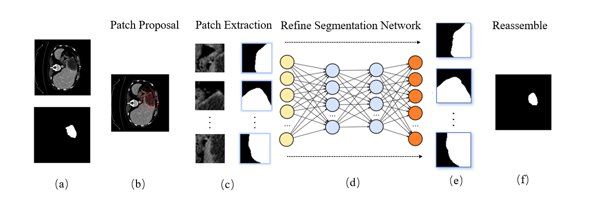
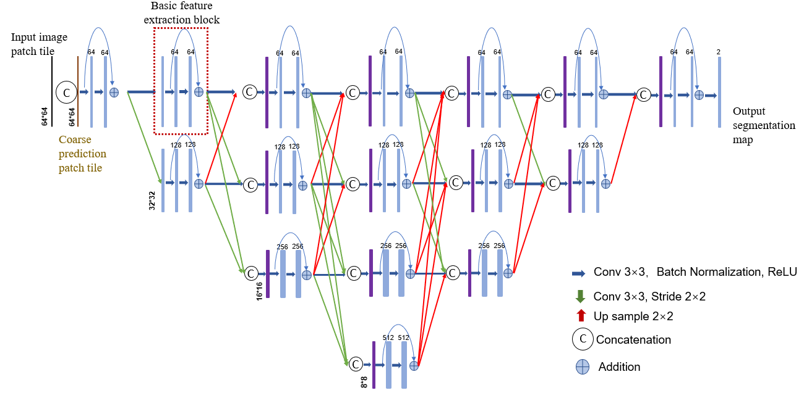
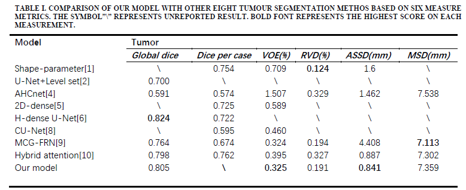
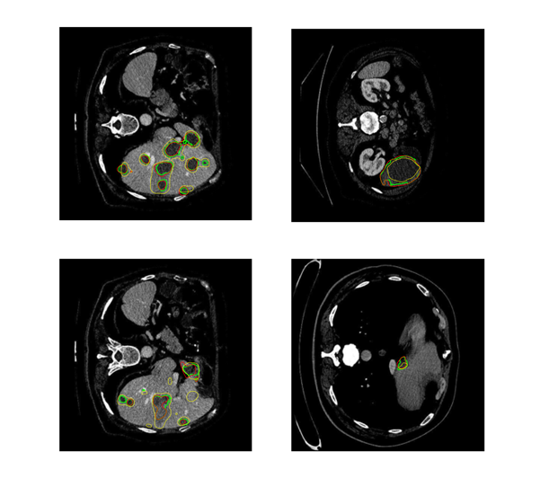

# Boundary Refinement Network for Liver Tumour Segmentation

## Overview

This repository contains the implementation of the **Boundary Refinement Network (BRN)** proposed in my PhD research for liver tumour segmentation in abdominal CT images.

Instead of directly predicting the entire tumour mask, the proposed framework refines the coarse tumour segmentation by learning only the boundary regions. A patch-based refinement strategy is adopted to improve segmentation accuracy around complex tumour boundaries while preserving the overall tumour structure.

The method is designed as a post-processing refinement stage and can be integrated with different liver tumour segmentation networks.

---

## Highlights

- Patch-based boundary refinement
- Dedicated refinement network for tumour boundaries
- Boundary mask guidance
- Majority voting for overlapping patches
- Improved boundary accuracy with limited computational cost

---

## Framework

The complete framework consists of four stages:

1. Coarse tumour segmentation
2. Boundary extraction
3. Patch refinement network
4. Patch reconstruction and majority voting

<p align="center">

</p>
---

## Boundary Refinement Strategy

The proposed method only refines pixels located around tumour boundaries.

The coarse segmentation is first converted into a boundary map. Image patches centred on boundary pixels are extracted together with their corresponding coarse segmentation masks. Both inputs are fed into the Boundary Refinement Network, which predicts refined tumour boundaries.

After all boundary patches have been processed, the refined patches are stitched back into the original image using an overlapping voting strategy to generate the final tumour segmentation.

<p align="center">

</p>

---

## Repository Structure

```text
Boundary-Refinement-Network/
│
├── README.md
├── train.py
├── predict.py
├── visualize.py
├── requirements.txt
│
├── models/
│   └── boundary_refinement_network.py
│
├── dataset/
│   ├── data_loader.py
│   ├── patch_generator.py
│   └── reconstruction.py
│
├── utils/
│   ├── losses.py
│   ├── metrics.py
│   └── boundary.py
│
├── checkpoints/
│
├── figures/
│
└── results/
```

---

## Training

The Boundary Refinement Network is trained using boundary image patches extracted from coarse tumour segmentation results.

Training images consist of:

- Original CT patch
- Coarse tumour mask patch
- Ground truth boundary patch

---

## Inference

During inference:

1. Generate coarse tumour segmentation.
2. Extract boundary regions.
3. Generate boundary patches.
4. Refine each boundary patch.
5. Reconstruct the full segmentation using majority voting.

---

## Experimental Results

Quantitative comparisons with several state-of-the-art liver tumour segmentation methods on the LiTS dataset are shown below.

<p align="center">

</p>

The proposed Boundary Refinement Network further improves the coarse segmentation results, achieving better boundary accuracy while maintaining competitive Dice performance.


---
## Visualisation

Examples of boundary refinement results are shown below.

Green contours denote the ground truth, while yellow contours denote the refined segmentation produced by the proposed Boundary Refinement Network.

<p align="center">

</p>

The proposed method is able to recover more accurate tumour boundaries for both large and small lesions.
